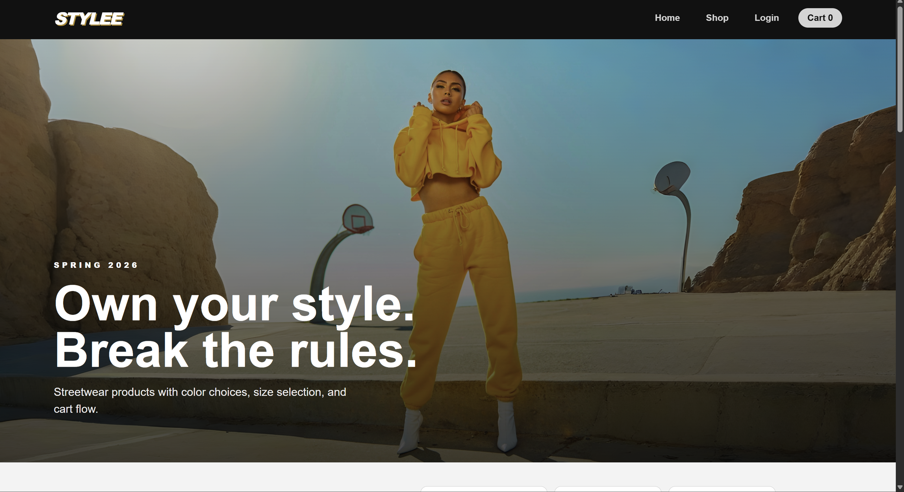
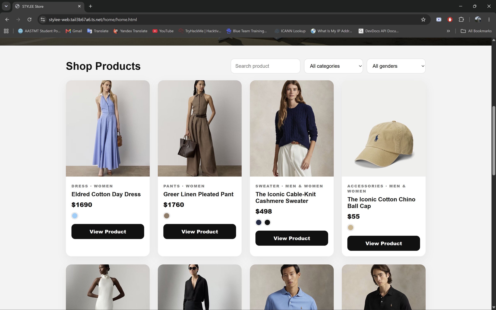
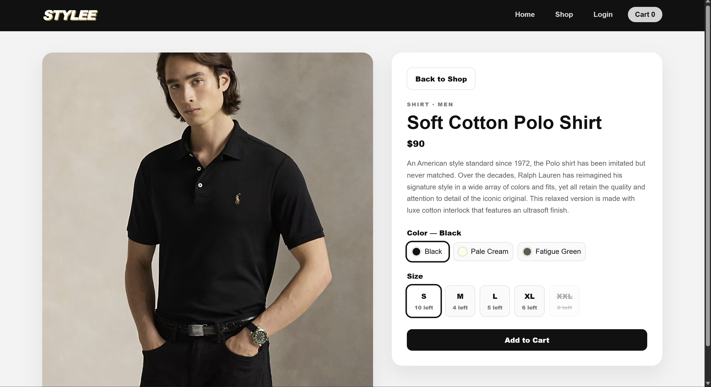
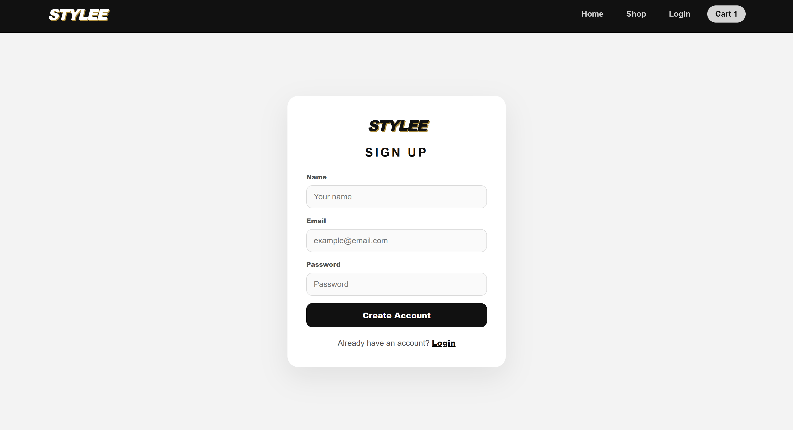
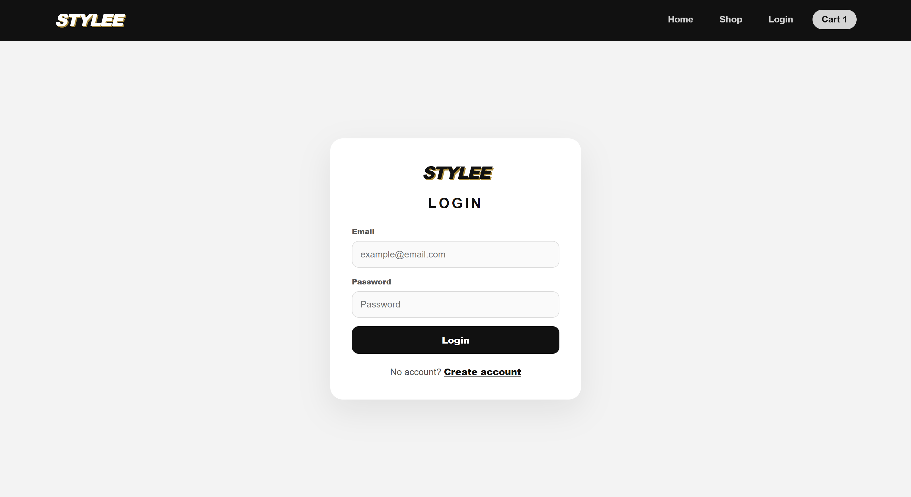
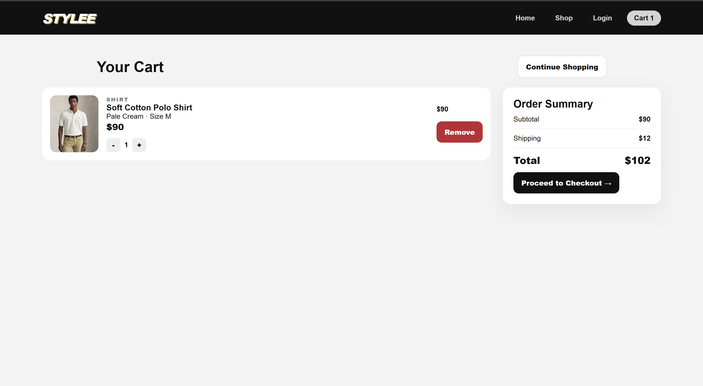
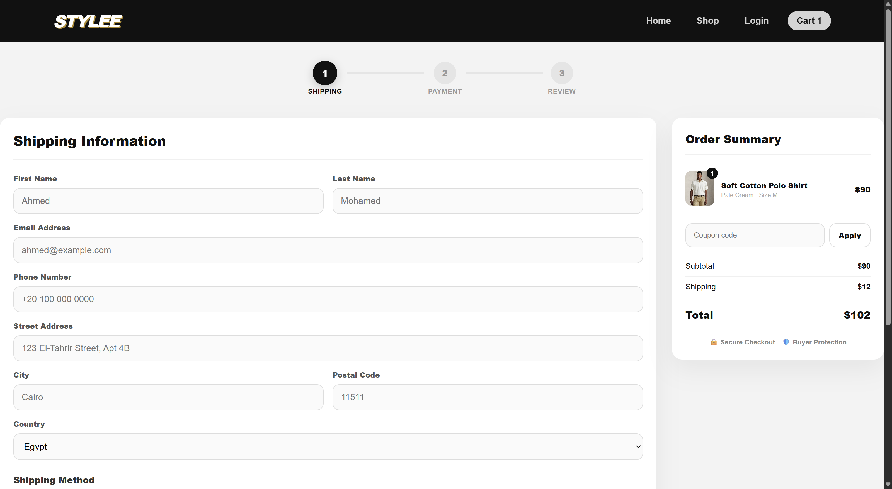
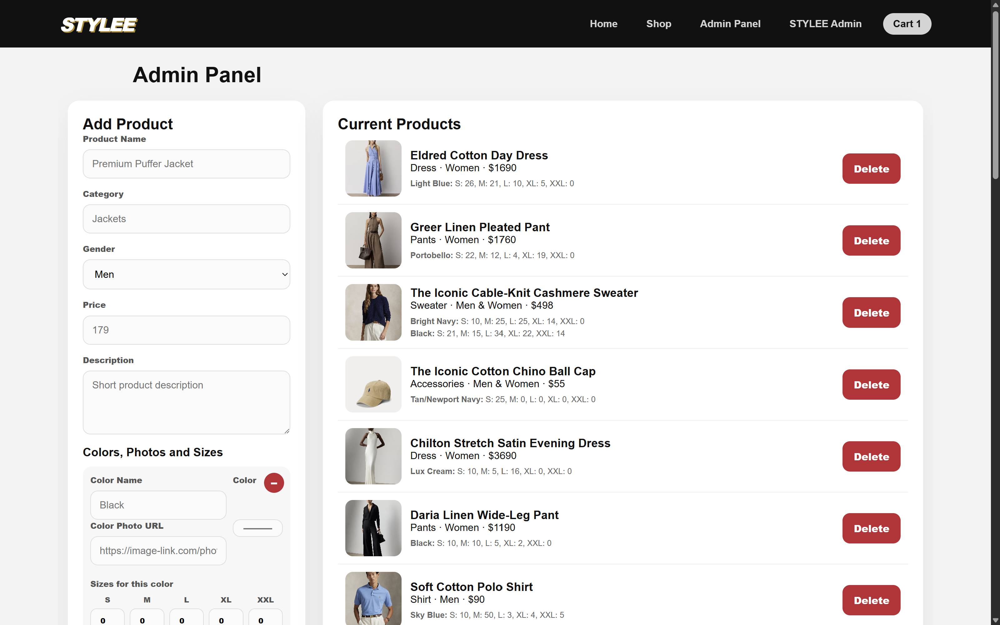
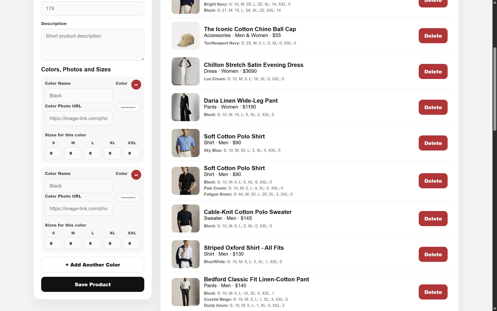

# stylee-ecommerce

A sleek, responsive streetwear e-commerce platform built with a component-based architecture using HTML, CSS, JavaScript, and PHP.

STYLEE handles a complete shopping flow—from dynamic product filtering to checkout—featuring a custom UI, role-based dynamic navigation, and a modular folder structure that keeps assets, markup, and logic neatly organized per feature.

---

## 🌍 Live Deployment & Infrastructure

**STYLEE is fully deployed and live.** The application is completely up, running, and publicly accessible to any user, anywhere.

* **Self-Hosted Bare-Metal Server:** The platform runs on our own Dell Precision 7810 server running Proxmox, giving us full control over the underlying Apache/MySQL environment rather than relying on a third-party host.
* **Public Domain & Routing:** The deployment includes a fully configured public domain with active routing, allowing the site to securely handle real, global live traffic.
* **Production-Grade Hosting:** Running on dedicated hardware rather than shared/virtual hosting gives the team full control over performance tuning, security hardening, and uptime.

---

## 🎥 Demo

### 1. Home & Hero Section
*Clean, bold typography emphasizing brand identity.*


### 2. Shop Catalog & Filtering
*Intuitive product grid with custom category dropdowns.*


### 3. Dynamic Product Details
*Real-time color and size selection with live variant toggling.*


### 4. Custom Authentication Flow
*Secure user registration and login forms built from scratch.*



### 5. Shopping Cart Management
*Persistent cart engine supporting active quantity tracking.*


### 6. Checkout Funnel
*Interactive multi-stage validation pipeline for order completion.*


### 7. Dynamic Admin Panel
*Protected admin dashboard, only accessible and visible to authenticated admin users.*



---

## ✨ Features

* **Dynamic Role-Based Authentication:** The login and navigation flow is fully dynamic and session-aware. When a user logs in with admin credentials, a protected **"Admin Panel"** button dynamically appears in the navbar. For standard users, the experience defaults to the regular client view, and the admin link stays completely hidden.
* **Component-Based Architecture:** Clean separation of features. Every page (Home, Cart, Login, etc.) is isolated in its own directory containing its respective HTML, CSS, JS, and PHP files.
* **Advanced Product Catalog:** Interactive grid layout featuring category filtering and responsive design.
* **Dynamic Product Details:** Real-time variant selection and image toggling built with vanilla JavaScript.
* **Custom Authentication:** Secure user registration and login portals utilizing PHP session management.
* **Persistent Cart & Checkout:** Client-side cart management supporting the complete order lifecycle.

---

## 🛠️ Tech Stack

* **Frontend (Decoupled UI):** HTML5, CSS3 (custom root variables, flexbox/grid layouts), JavaScript (DOM manipulation, state management, dynamic UI rendering)
* **Backend (PHP Endpoints):** Vanilla PHP 7.4+ (routing, session management, and view rendering)
* **Database:** MySQL
* **Infrastructure:** Self-hosted bare-metal server (Dell Precision 7810, Proxmox) with public DNS routing.

---

## 🗂️ Project Structure

```
stylee-ecommerce/

├── admin/

│   ├── admin.css
│   ├── admin.html
│   ├── admin.js
│   └── admin.php
├── assets/
│   └── hero.png
├── cart/
│   ├── cart.css
│   ├── cart.html
│   ├── cart.js
│   └── cart.php
├── checkout/
│   ├── checkout.css
│   ├── checkout.html
│   └── checkout.js
├── database/
│   ├── database.sql
│   ├── migration_v2_color_swatches.sql
│   └── migration_v3_delivery_status.sql
├── demo/
│   └── (all presentation screenshots)
├── home/
│   ├── home.css
│   ├── home.html
│   ├── home.js
│   └── home.php
├── login/
│   ├── login.css
│   ├── login.html
│   ├── login.js
│   └── login.php
├── product-details/
│   ├── product-details.css
│   ├── product-details.html
│   ├── product-details.js
│   └── product-details.php
├── products/
│   ├── products.css
│   ├── products.html
│   ├── products.js
│   └── products.php
├── register/
│   ├── register.css
│   ├── register.html
│   └── register.js
├── shared/
│   ├── config.php
│   ├── data.js
│   ├── functions.php
│   ├── index.php
│   ├── shared.css
│   └── utils.js
├── core.php
└── README.md
```
---

## 🚀 Setup & Local Development

To run a local development instance of the live site:

1. **Clone the repository:**
```bash
   git clone https://github.com/mazenhamada3/stylee-ecommerce.git
```

2. **Configure your local environment:**
   * Move the project directory to your local web server root (e.g., `htdocs` for XAMPP or `/var/www/html`).

3. **Import the Database:**
   * Open phpMyAdmin or your MySQL CLI.
   * Import the database schema file inside the `database/` folder to build the tables.

4. **Connect the Backend:**
   * Update the database credentials inside your connection configuration inside `shared/` or `core.php` to match your local MySQL setup.

5. **Run:**
   * Navigate to `http://localhost/stylee-ecommerce/home/home.html` in your browser.

---

## 👤 Team Contributions

**My Specific Focus Areas:**
I worked across the **frontend UI/UX, client-side logic, and view rendering layers** using HTML, CSS, JavaScript, and PHP for key user flows. *(Note: Core database queries, database connector logic, and SQL schema design were handled by my team partner.)*

| Module | Files | What I Built |
| :--- | :--- | :--- |
| **Registration Flow** | `register/register.html`, `register.css`, `register.js` | Engineered the visual layout, responsive structural design, and client-side form architecture/validation for user onboarding. |
| **Product Catalog** | `products/products.html`, `products.css`, `products.js` | Built the responsive product grid, styled the UI components, and wrote the frontend JavaScript logic to handle category filtering and rendering. |

---

## ⚠️ Disclaimer
While this project is actively deployed on our servers, it originated as a collaborative project. For enterprise-level scaling, the backend endpoints should be further hardened with advanced CSRF protection and strict CORS policies.
